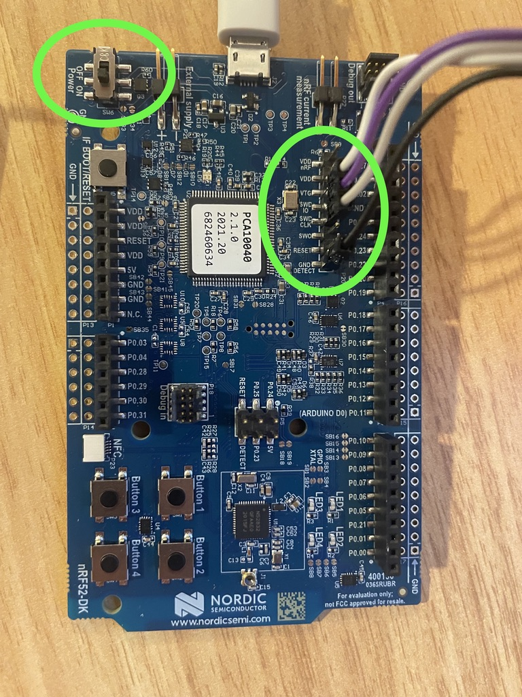
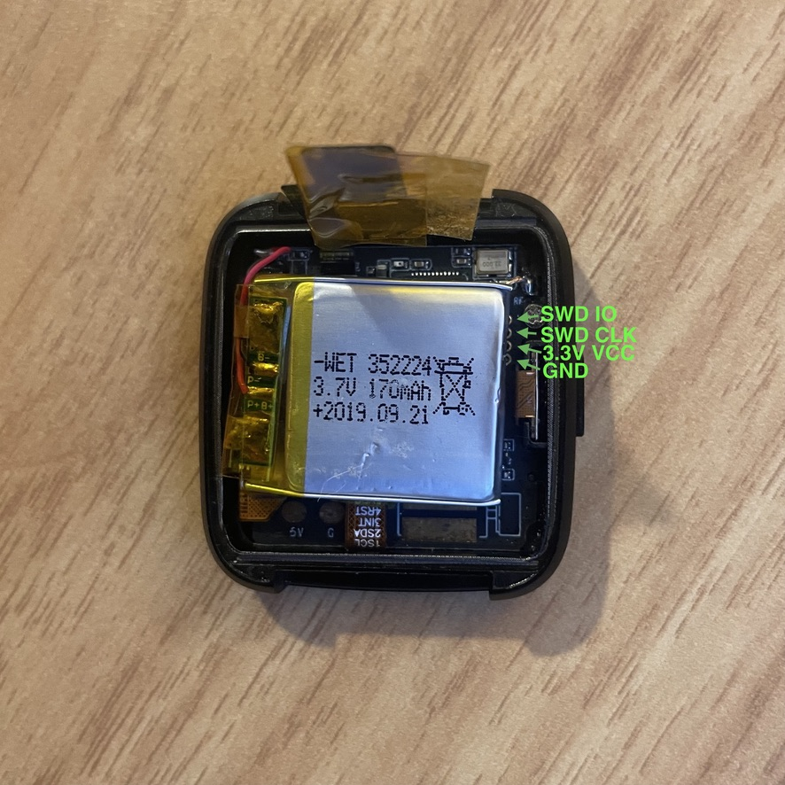
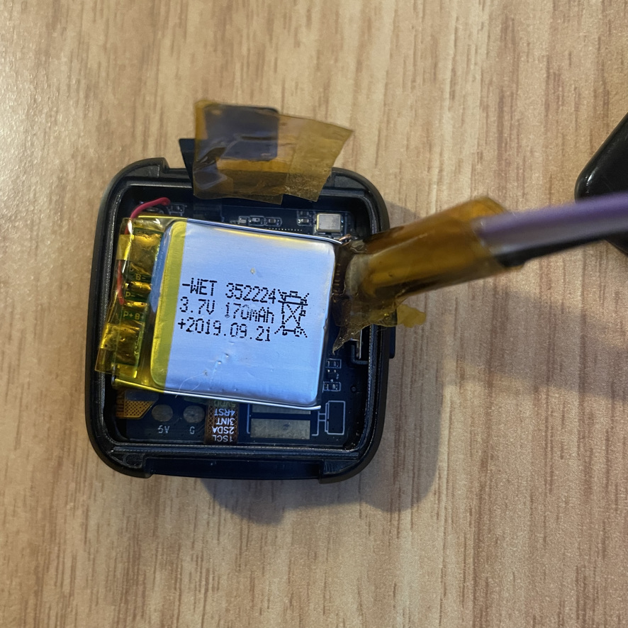
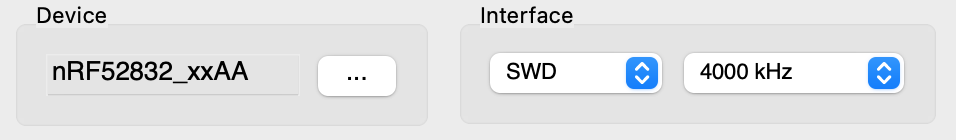
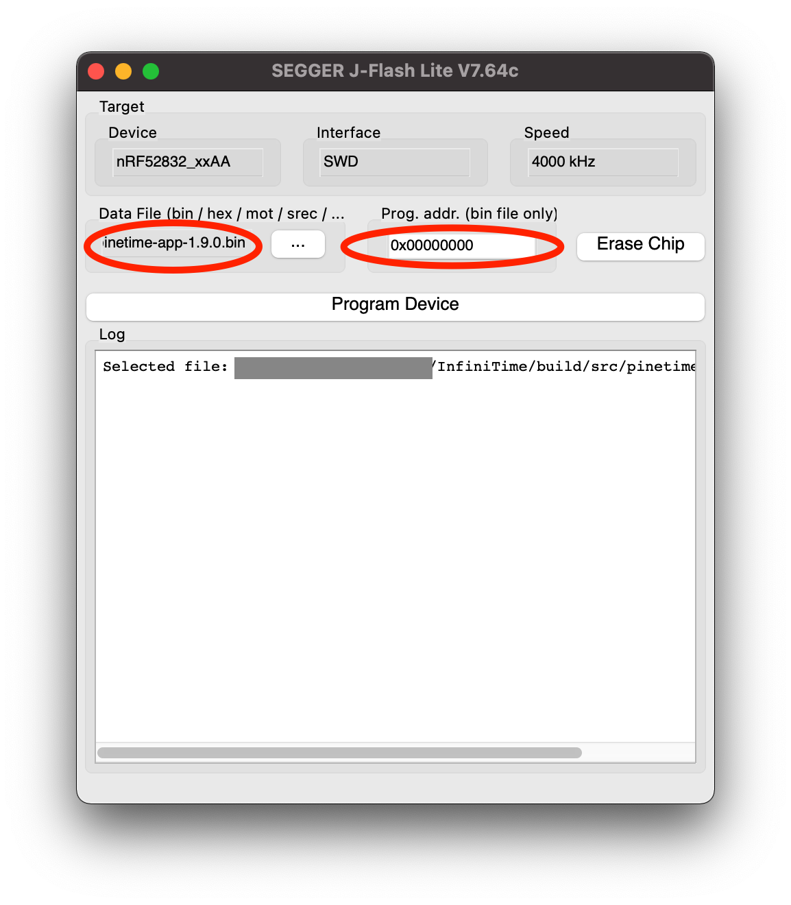
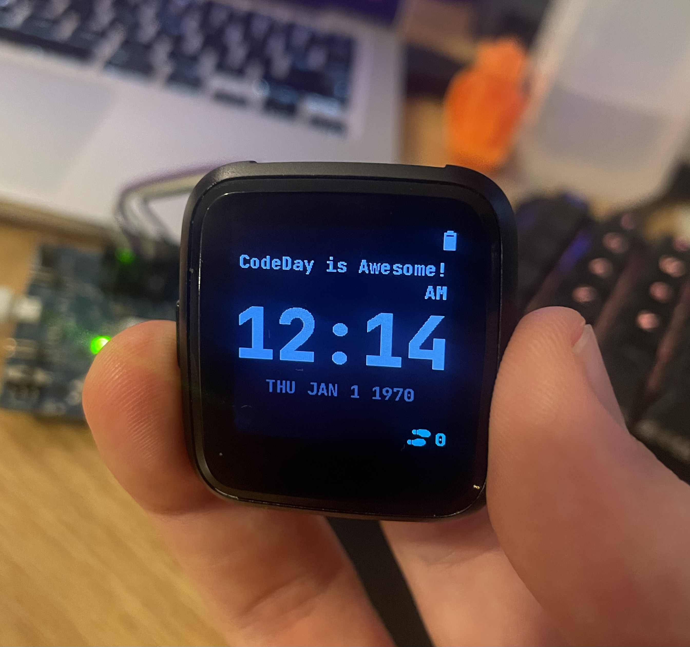

# PineTime

## Onboarding Week Goals

By the end of onboarding week, you should be able to:

- Download and compile the InfiniTime operating system (you can do this even before your Dev Kit arrives)
- Load the compiled application onto your watch
- Modify the default watchface somehow (for example, add your name somewhere on the screen)

When you've reached this point, submit a photo of your watch running your modified operating system.

{: .note-title}
> ✅ **Where do I submit?**
> 
> After completing this assignment, submit a link to a photo of your watch using the form on your participant dashboard by logging in at [https://labs.codeday.org/dash](https://labs.codeday.org/dash)

{: .note-title}
> ❓ **What if I need help?**
> 
> 
> You can ask for help in #ask-for-help or schedule a CSE session.

# Getting started with InfiniTime

The primary operating system that runs on the PineTime is called [InfiniTime](https://github.com/InfiniTimeOrg/InfiniTime). In this section, we’ll clone the InfiniTime source code, download the tools needed to compile InfiniTime, and end up with a “image” file that can be flashed onto your hardware. This guide assumes you have a UNIX-y operating system, such as MacOS or Linux. If you’re using Windows, you may need to work inside a Linux VM. If you’re not sure how to do this, ask. 

Follow [this guide](https://github.com/InfiniTimeOrg/InfiniTime/blob/develop/doc/buildAndProgram.md) to:

- Download the compiler, SDK, and other tools you’ll need to build the firmware.
- Clone the InfiniTime git repository.
- Build the project.

At the end of this guide, you should have a `pinetime-app.bin` file.

For further reading:

[https://github.com/InfiniTimeOrg/InfiniTime/blob/develop/doc/code/Intro.md](https://github.com/InfiniTimeOrg/InfiniTime/blob/develop/doc/code/Intro.md)

[https://github.com/InfiniTimeOrg/InfiniTime/blob/develop/doc/branches.md](https://github.com/InfiniTimeOrg/InfiniTime/blob/develop/doc/branches.md)

# Getting started with the PineTime hardware

### What you’ll need

From CodeDay, you should receive 

- PineTime dev kit (in the clear plastic box)
    - PineTime smartwatch with unsealed back cover
    - USB charging dock
    - SWD adapter cable (flat cable with headers on one end)
- nRF52-DK development board (in the blue cardboard box)
    - Dev board
    - NFC antenna (you won’t need this for this project)

In addition to what was shipped to you, you’ll need

- MicroUSB cable that can connect to your computer.
- Clear tape (clear packing tape or Kapton tape)

You might find the following tools useful, but they are not required:

- Multimeter
- Oscilloscope
- Logic Analyzer
- Basic Soldering Equipment

### Hookup Guide

{: .warning}
> The inside components on your development watch are very fragile. In particular, the battery wires and heart rate sensor are easy to break. Use extra care when touching these components.
> 
> Be careful to connect the wires correctly. Incorrectly connecting the wires can damage your device.

In order to download code to your PineTime dev kit, you’ll need to use an SWO adapter to connect it to your computer. The nRF52-DK board has a “J-Link OB” (that’s the model name) SWO adapter built into it. 

There are four wires that must be connected:

| Label on nRF52-DK | Wire Color in Photos | Description |
| --- | --- | --- |
| GND DETECT | Black | Signal Ground |
| SWD CLK | Grey | “Serial Wire Debug” Clock |
| SWD IO | Purple | “Serial Wire Debug” Data |
| VTG | White | External Voltage. This is required for the J-Link to detect that an external device is connected. It connects to 3.3v VCC from the watch.  |

{: .note}
> ☝ The wire colors of your SWD adapter cable may be different from what’s in the photos here. This is OK. What matters is the physical order of the wires. If you need help, ask.

1. Connect your adapter cable as described in the table above. 
2. Connect the dev board to your computer using a MicroUSB cable.
3. Turn on the power switch.

Connect the adapter cable to the pin header shown. Once connected to your computer, turn on the power switch shown.

Once the adapter cable is connected to the nRF52-DK board, you can connect the other end to your PineTime.

To the right of the battery, the SWD test points are visible. You may need to scooch the battery over (or carefully peel it up) to reveal these.

The pin end of the adapter cable is inserted into the test points. Friction is usually enough to hold it in place. 

For further reading:

[https://wiki.pine64.org/wiki/PineTime_Devkit_Wiring](https://wiki.pine64.org/wiki/PineTime_Devkit_Wiring)

[https://wiki.pine64.org/wiki/Reprogramming_the_PineTime#nrfjprog_(for_Segger_JLink)](https://wiki.pine64.org/wiki/Reprogramming_the_PineTime#nrfjprog_(for_Segger_JLink))

### J-Link Crash Course

J-Link is a series of debug probes manufactured by Segger. A debug probe is an adapter that allows your computer to interface with a microcontroller at a very low level. In addition to downloading your program onto a microcontroller, a debug probe can set breakpoints, pause/resume execution, and read the memory of the microcontroller.

Here are some utilities that come with the J-Link software package that you should be aware of:

- **JLinkRTTViewer** will allow you to view the debugging logs from the device.
- **JFlashLite** will allow you to download code onto your watch.

When configuring the J-Link software, the device name is “nRF52832_xxAA”. Select “SWD” interface (JTAG will not work). 4000 kHz is a good starting interface speed. If you run into problems, try reducing the speed (needing to do this is rare).

Settings to use when configuring J-Link software

To flash your PineTime

1. Compile the operating system, as described above.
2. Connect your PineTime to your computer as described in “Hookup Guide”.
3. Open J-Flash Lite. Select the `pinetime-app-x.x.x.bin` file that you compiled earlier. Click “Program Device”.

For further reading:

[https://www.segger.com/downloads/jlink/UM08001](https://www.segger.com/downloads/jlink/UM08001)

# Making your first change to InfiniTime

For your first change to InfiniTime, make a change to the default watch face (the screen that displays the time when the watch wakes up from sleep). Add some text, move the icons around, etc. Feel free to do something goofy. The goal of this is to get familiar with the layout of the codebase and figure out what parts of the code do. If you feel like you’re getting stuck, ask for help.

Once you’ve made this change, compile your application and download it onto your watch. Take a photo and submit it. 

Example of a Modified Watchface