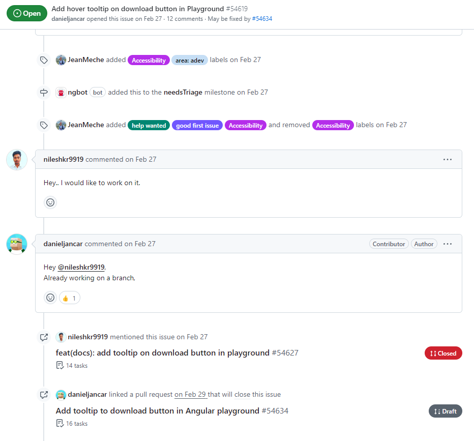

# OS Project Contribution Guide
{: .no_toc }

  

    Table of contents
  

  {: .text-delta }
1. TOC
{:toc}

While your internship at CodeDay Labs comes to an end, your journey of contribution does not have to stop here. You have gained a great deal of knowledge about Open Source Projects from CodeDay Labs and we would love to see you continue to practice more of these and improve them. Even though most of the projects have always been very approachable and friendly to their contributors, adding new features can occasionally be challenging. Your work on open source software can serve as evidence of your abilities when you apply for jobs. 

This guide includes some useful quick tips you can use to participate in any project more effectively which are as follows:

## 🤔 Understand your contributions in Projects.
Many people think open source is only about contributing code, but it's much more than that. Contributions to open source projects come in various forms—from fixing a typo in documentation to writing 100 lines of code for a new linter or enhancing a software's user interface. Each type of contribution has its own unique value.
While it is easier for someone to contribute to a project, it can occasionally be difficult to pinpoint your area of interest within that particular project. This is the point where putting in some time and effort into a project pays off because you will discover your area of interest and develop a deeper understanding of it. Therefore, it is often easier to continue working on a project you are already familiar with rather than starting with a new one.

Typical ways to contribute can be:
- Making changes to documentation
- Adding sample output to show how the code works.
- Writing/making videos for in-depth tutorials for the project.
- Writing blogs for a project.
- Adding translation for a project.
- Fixing typos; broken URLs or Images.
- Making design contribution.
    
## 🔍 Finding a Project for yourself the right way.
When searching for a new project to contribute, keep an eye out for these elements that can help you choose the right project:

- **Aligns with Your Interests**: Select the project that is in line with your interests or the skills you would like to learn. It sustains your motivation.
- **Verify Activity Levels**: Seek out project that is in the process of development. A healthy project is indicated by frequent commits, recent pull requests, and active issues.
- **Evaluate Community Engagement**: Participating can be more fun in a friendly and accommodating community. Look for a code of conduct, helpful maintainers, and ongoing discussions.
- **Read the Documentation**: Proper documentation is essential. Make sure the project has a roadmap or vision, as well as clear setup instructions and guidelines for contributions.
- **Start Small**: Search for problems marked as "Help Wanted" or "Good First Issue." These are typically easy enough for beginners to do.
- **License**: Make sure the project is licensed under an open-source agreement that supports your objectives, particularly if you intend to reuse or alter the code.
    
## 🧠 Pick those Issues and submit PRs mindfully.
- **Comment that you are working on the Issue:** Before tackling any issue, always inform the maintainers that you would like to work on it and request to have it assigned to you. This prevents duplication of efforts and ensures everyone knows who is handling what. Your contribution might go to waste if you work on an issue without notifying the maintainers. Here are some examples to guide you:
    - ❌ **What you can avoid**        
            
    - ✅ **What is encouraged**        
            
- **Abide by CONTRIBUTING.MD guide and README:** These files outline the project's contribution guidelines. Read and follow them carefully. Adhering to these guidelines streamlines the review process and ensures your contributions align with the project's goals.
- **Double-check before submitting:** Before submitting a pull request, carefully review your code for accuracy, adherence to guidelines, and potential errors. This practice demonstrates professionalism and minimizes the need for back-and-forth revisions.
        
        
## 🤝 Get involved with Communities and join those Office Hours.
Collaborating on open source projects means joining a community where you can develop soft skills like emotional intelligence and communication. By engaging in forums, discussions, or office hours, you strengthen your involvement and create opportunities to learn, receive feedback, and build relationships with both contributors and maintainers. This active participation is an excellent way to grow within the open source ecosystem.
    
- **Be an active communicator:** Maintain open communication channels with maintainers and fellow contributors. Whether you are providing progress updates or seeking clarification, consistent communication fosters trust and facilitates seamless collaboration.
- **Be Respectful and Inclusive to others:** Open source thrives on collaboration. Treat others with respect and foster inclusivity. Diverse perspectives enhance projects, and creating a welcoming environment encourages more contributions.
        
        
## ✅ Communicate with the MAINTAINERS as much as you can!
Yes, we understand that many new contributors hesitate when they think of communicating with project maintainers. However, we strongly encourage you to take this step and build healthy relationships with maintainers. You can reach out to them on the community platform or in the GitHub Issue itself. 
    
Networking with maintainers and other contributors fosters long-term growth, opens up mentorship opportunities, expands your learning, and increases the visibility of your contributions. Maintainers are generally pleased when you reach out to them, but it is important to be mindful when doing so. Here are a few tips to keep in mind when contacting maintainers:
- **Be respectful of maintainers' time**: Remember that maintainers are often volunteers who dedicate their free time to the project. When reaching out, be concise and clear about your questions or concerns.
- **Do your homework first**: Before contacting maintainers, try to find answers in the project's documentation, issue tracker, or previous discussions. This shows initiative and respect for their time.
- **Be patient and understanding**: Maintainers may not respond immediately. Give them time to review your message and respond. If you don't hear back after a reasonable period, a polite follow-up is acceptable.

> **Some links to useful resources for you**

- [5 tips for getting involved in open-source projects on GitHub (hashnode.dev)](https://fasani.hashnode.dev/5-tips-for-getting-involved-in-open-source-projects-on-github-ckdrmibup00unfzs1e56ugo1q)
- [10 ways you can contribute to Open-source (hashnode.dev)](https://movi.hashnode.dev/10-ways-you-can-contribute-to-open-source)
- [roadmap.sh/git-github](https://roadmap.sh/git-github)
- [github.com/shainakrumme/open-source-handbook](https://github.com/shainakrumme/open-source-handbook)
- [Open Source Education with OpenSauced](https://opensauced.pizza/learn)
- [Not-ternships](https://www.youtube.com/playlist?list=PLIRjfNq867bf4Xdx7ZRK6hFBSsEmS2NUV)